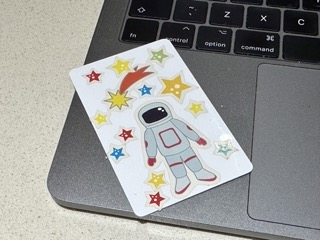

# py-to-player
A Raspberry Pi, RFID controlled, audio player for children. 

These are mostly notes so that I can recall the steps to recreate this project if needed.

The aim is to create a music/audio book player that will play local files when triggered with an RFID card/sticker. The output device is an existing Amazon Alexa, connected with Bluetooth.

## Equipment list
- Raspberry Pi Zero W
- RC522 RFID
- NTAG-213 stickers
- Amazon Alexa Dot

## RC522 pin configuration
- SDA connects to Pin 24
- SCK connects to Pin 23
- MOSI connects to Pin 19
- MISO connects to Pin 21
- GND connects to Pin 6
- RST connects to Pin 22
- 3.3v connects to Pin 1

## Raspberry Pi configuration
I used a Pi Zero W as this was readibly available with the header already soldered.

### Enable SPI
- `sudo raspi-config`
- Interfacing Options
- SPI
- Activate > Yes > OK
   
### Disable built-in audio (the HDMI, that I do not want to use)
- `sudo nano /boot/config.txt`
- #dtparam=audio=on

### Raspberry Pi Audio Configuration (Making the Bluetooth Speaker work)
Setting the audio out to use the bluetooth speaker is slightly trickier. 

Pair the bluetooth speaker:

- `bluetoothctl -a`

- `pair 44:3D:54:B9:30:55`

- `trust 44:3D:54:B9:30:55`

After pairing the bluetooth speaker, identify the audio sinks using:

- `pacmd list-sinks`
- The output will be like: `bluez_sink.44_3D_54_B9_30_55.a2dp_sink.monitor`

Initially I tried to set a default sink in the conf file using the name of the sink (this is recommended as the sink number can change).

- `/etc/pulse/client.conf.`

As the default sink in the conf file proved unreliable, I created a shell script that launches on boot via the cron tab

- `sudo crontab -e`

- `@reboot sh /path/to/launch.sh`

launch.sh contains the following.

- `echo "disconnect 44:3D:54:B9:30:55" | bluetoothctl`

- `echo "connect 44:3D:54:B9:30:55" | bluetoothctl`

- `pacmd "set-default-source bluez_sink.44_3D_54_B9_30_55.a2dp_sink.monitor"`

With these settings, the Raspberry Pi will connect to the Alexa on reboot.

Next, I need the python script to launch after a reboot. I did this by adding the following to the crontab

- `@reboot python py-to-player.py`

## Python environment
To make this work we need to use the library for the RFID reader. I used https://github.com/pimylifeup/MFRC522-python. 

### Install packages
- pip install pygame
- pip install spi-dev
- pip install mfrc-python

This MFRC library worked well as I don't need to be able to write to the RFID stickers. I'm only using the NTAG-213 stickers to read the ID and use this to determine what audio to play (the audio files are simply called the name of the NTAG + .mp3. This allows me to use the NTAG-213 stickers that you get lots of on Amazon/ebay for just a few £ - cheap and cheerful but you will get an authentication error when you read them. You can ignore this. 

## Python script
This is mostly commented in the code. The intention was to set the RFID reader to read a tag when it was presented. If the tag matched a file (TAGID + .mp3) then that file would be played; if the tag matched a directory (TAGID) then the files in that directory would be played in a random order.

Scanning another tag will replace the currently playing audio file. 

I also created a couple of 'helper tags' that each call a function:

- One that stops any audio that is playing. 
- One that reconnects the bluetooth speaker. 

## Playing the audio
To play the audio you tap the RFID reader with the NTAG-213 sticker. To make this easy, we stuck these on the barcodes of the books that we had recorded audio for.

We also created some custom cards using an RFID card (MIFARE) that were decorated to identify what would be played: in this case [i]Zoom Zoom Zoom, We're Going to the Moon [i]

Here's a video of all this working:

https://github.com/geoawd/py-to-player/assets/119129964/6a3aa846-1b57-4f23-acfb-dcd90f84ee43

## Updating the library
The easiest way to update the library is:
- scan an NTAG-213 sticker
- create an mp3 with this name (.mp3) or a directory of this name containing some audio files (.mp3)
- scp these files to the Raspberry Pi

